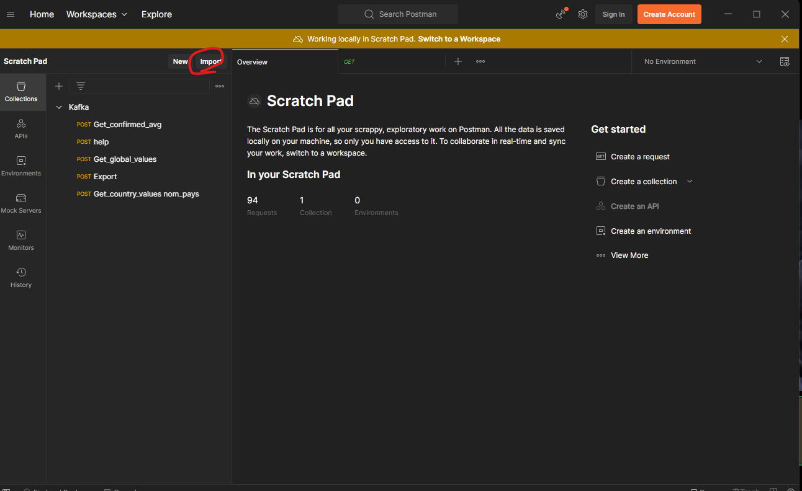

# Rapport du TP Intergiciel

### Développeurs :

- Massar ABBAS - [massar.abbas@uphf.fr](mailto:massar.abbas@uphf.fr) - 22105551
- Elliott ATTENBOROUGH - [elliott.attenborough@uphf.fr](mailto:elliott.attenborough@uphf.fr) - <n° étudiant à mettre>

## 1. Exécution du projet
Toutes les commandes sont à faire à la racine du projet.

### a. Construire l'image docker du projet Java

Afin de construire l'image docker du projet, lancez la commande suivante :

````shell
docker build --no-cache -t myapp:latest .
````


### b. Lancer les conteneurs Docker

Avant de lancer l'application, pour démarrer le service kafka et zookeeper, lancez le container docker avec la commande suivante :


```shell
docker-compose up
```


### c. Tests sur Postman

Importez le fichier `Kafka.postman_collection.json` dans Postman. Il se trouve à la racine du projet.




## 2. Réponse aux Questions

### Question 1:

En utilisant Mirth Connect, on aurait pu mettre en place une architecture similaire en utilisant des canaux de communication pour l'échange des messages entre les différents modules. On aurait également pu utiliser des sockets ou des web services REST pour les échanges.

Cependant, cette solution aurait été moins performante que Kafka, car Mirth Connect n'est pas conçu spécifiquement pour les échanges massifs de données en temps réel.

De plus, Kafka possède des fonctionnalités de tolérance de pannes qui sont très utiles dans le contexte de l'échange de données entre les différents modules d'une application, mais aussi dans le contexte d'une application de microservices.

### Question 2 :

Les deux architectures proposées ont leurs avantages et leurs inconvénients. L'architecture utilisant Kafka offre une bonne scalabilité et une haute disponibilité grâce à la réplication des messages, tandis que l'architecture basée sur Mirth Connect est plus simple et moins coûteuse à mettre en place.

Cependant, la complexité de l'architecture avec Kafka peut être justifiée pour des applications nécessitant une grande fiabilité et une forte tolérance aux pannes.

En revanche, pour des applications moins critiques, l'utilisation d'un EAI comme Mirth Connect peut être suffisante et plus simple à maintenir.

### Question 3 :

Il existe plusieurs façons de sécuriser les échanges dans Kafka, notamment :

- Authentification : qui permet de s'assurer que les parties impliquées dans les échanges sont bien celles qu'elles prétendent être.
- Autorisation : qui permet de contrôler l'accès aux ressources et aux actions sur le bus Kafka.
- Chiffrement : qui permet de protéger les données en transit en les rendant illisibles pour les personnes qui ne sont pas autorisées à les voir.

Parmi ces différentes possibilités, une méthode possible pour sécuriser les échanges dans Kafka est d'utiliser SSL/TLS. Cette méthode permet de chiffrer les données en transit et d'authentifier les parties impliquées dans les échanges en utilisant des certificats.

Pour mettre en place cette méthode, il est nécessaire de générer des certificats et des clés pour chaque broker Kafka et chaque client Kafka. Ensuite, il faut configurer les brokers et les clients pour qu'ils utilisent SSL/TLS en utilisant les certificats et les clés générés précédemment. Enfin, il faut s'assurer que les certificats sont bien distribués aux parties impliquées dans les échanges et que les connexions sont bien sécurisées.
